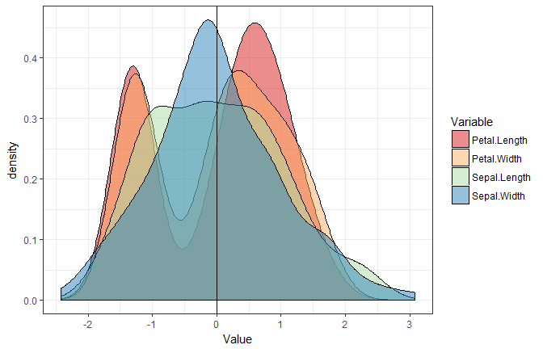

Standardize / Normalize / Z-score / Scale
-----------------------------------------

The `standardize()` function allows you to easily scale and center all numeric variables of a dataframe. It is similar to the base function `scale()`, but presents some advantages: it is tidyverse-friendly, data-type friendly (*i.e.*, does not transform it into a matrix) and can handle dataframes with categorical data.

``` r
library(psycho)
library(tidyverse)
```

    Warning: package 'tidyverse' was built under R version 3.4.2

    -- Attaching packages ------------------------------------------------------------------------------------------------------------------------------------------------------ tidyverse 1.2.0 --

    v ggplot2 2.2.1     v purrr   0.2.4
    v tibble  1.4.2     v dplyr   0.7.4
    v tidyr   0.8.0     v stringr 1.2.0
    v readr   1.1.1     v forcats 0.2.0

    Warning: package 'ggplot2' was built under R version 3.4.3

    Warning: package 'tibble' was built under R version 3.4.4

    Warning: package 'tidyr' was built under R version 3.4.3

    Warning: package 'purrr' was built under R version 3.4.2

    Warning: package 'dplyr' was built under R version 3.4.2

    -- Conflicts --------------------------------------------------------------------------------------------------------------------------------------------------------- tidyverse_conflicts() --
    x dplyr::filter() masks stats::filter()
    x dplyr::lag()    masks stats::lag()

``` r
z_iris <- iris %>% 
  psycho::standardize() 

summary(z_iris)
```

           Species    Sepal.Length       Sepal.Width       Petal.Length    
     setosa    :50   Min.   :-1.86378   Min.   :-2.4258   Min.   :-1.5623  
     versicolor:50   1st Qu.:-0.89767   1st Qu.:-0.5904   1st Qu.:-1.2225  
     virginica :50   Median :-0.05233   Median :-0.1315   Median : 0.3354  
                     Mean   : 0.00000   Mean   : 0.0000   Mean   : 0.0000  
                     3rd Qu.: 0.67225   3rd Qu.: 0.5567   3rd Qu.: 0.7602  
                     Max.   : 2.48370   Max.   : 3.0805   Max.   : 1.7799  
      Petal.Width     
     Min.   :-1.4422  
     1st Qu.:-1.1799  
     Median : 0.1321  
     Mean   : 0.0000  
     3rd Qu.: 0.7880  
     Max.   : 1.7064  

But beware, standardization **does not** change (and "normalize") the distribution!

``` r
z_iris %>% 
  dplyr::select(-Species) %>% 
  gather(Variable, Value) %>% 
  ggplot(aes(x=Value, fill=Variable)) +
      geom_density(alpha=0.5) +
      geom_vline(aes(xintercept=0)) +
      theme_bw() +
      scale_fill_brewer(palette="Spectral")
```


