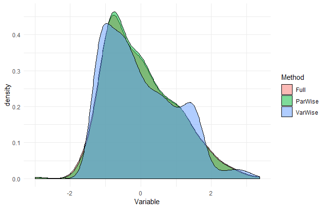
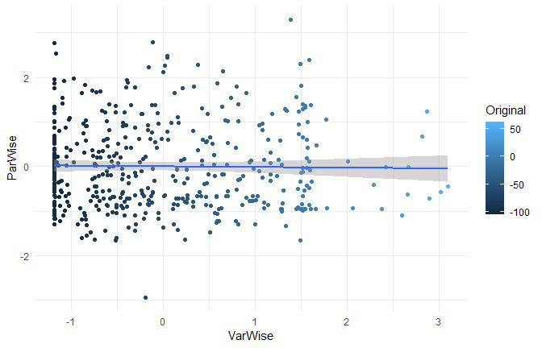

-   [The data](#the-data)
-   [Standardize](#standardize)
-   [Check](#check)
    -   [Characteristics at a general level](#characteristics-at-a-general-level)
    -   [Characteristics at a participant level](#characteristics-at-a-participant-level)
    -   [Distribution](#distribution)
-   [Correlation](#correlation)
-   [Test](#test)
-   [Conclusion](#conclusion)
-   [Credits](#credits)
-   [Previous blogposts](#previous-blogposts)

To make sense of their data and effects, psychologists often standardize (Z-score) their variables. However, in repeated-measures designs, there are three ways of standardizing data:

-   **Variable-wise**: The most common method. A simple scaling and reducing of each variable.
-   **Participant-wise**: Variables are standardized "within" each participant.
-   **Full**: Participant and variable wise.

Unfortunately, the method used is often not explicitely stated. This is an issue as these methods can generate important discrepancies that contribute to the reproducibility crisis of psychological science.

In the following, we will see how to perform those methods and look for differences.

The data
========

We will take a dataset in which participants were exposed to negative pictures and had to rate their emotions (**valence**) and the amount of memories associated with the picture (**autobiographical link**). One could make the hypothesis that in a young participants with no general context of war or violence, the most negative pictures (mutilations) are less related to memories than less negative pictures (involving for example car crashes or sick people).

``` r
library(tidyverse)
library(psycho)

df <- psycho::emotion %>% 
  filter(Emotion_Condition == "Negative")  # Discard neutral pictures

df %>% 
  group_by(Participant_ID) %>% 
  summarise(n_Trials = n(),
            Valence_Mean = format_digit(mean(Subjective_Valence, na.rm=TRUE)),
            Valence_SD = format_digit(sd(Subjective_Valence, na.rm=TRUE)),
            Autobiographical_Link_Mean = format_digit(mean(Autobiographical_Link, na.rm=TRUE)),
            Autobiographical_Link_SD = format_digit(sd(Autobiographical_Link, na.rm=TRUE))) %>% 
  mutate(Valence = paste(Valence_Mean, Valence_SD, sep=" +- "),
         Autobiographical_Link = paste(Autobiographical_Link_Mean, Autobiographical_Link_SD, sep=" +- ")) %>% 
  select(-ends_with("SD"), -ends_with("Mean"))
```

| Participant\_ID |  n\_Trials| Valence         | Autobiographical\_Link |
|:----------------|----------:|:----------------|:-----------------------|
| 10S             |         24| -58.07 +- 42.59 | 49.88 +- 29.60         |
| 11S             |         24| -73.22 +- 37.01 | 0.94 +- 3.46           |
| 12S             |         24| -57.53 +- 26.56 | 30.24 +- 27.87         |
| 13S             |         24| -63.22 +- 23.72 | 27.86 +- 35.81         |
| 14S             |         24| -56.60 +- 26.47 | 3.31 +- 11.20          |
| 15S             |         24| -60.59 +- 33.71 | 17.64 +- 17.36         |
| 16S             |         24| -46.12 +- 24.88 | 15.33 +- 16.57         |
| 17S             |         24| -1.54 +- 4.98   | 0.13 +- 0.64           |
| 18S             |         24| -67.23 +- 34.98 | 22.71 +- 20.07         |
| 19S             |         24| -59.61 +- 33.22 | 28.37 +- 12.55         |

As wee can see from the means and SDs, there is a lot of variability **between and within** participants.

Standardize
===========

``` r
Z_VarWise <- df %>% 
  standardize()

Z_ParWise <- df %>% 
  group_by(Participant_ID) %>% 
  standardize() 

Z_Full <- df %>% 
  group_by(Participant_ID) %>% 
  standardize() %>% 
  ungroup() %>% 
  standardize() 
```

Check
=====

Let's see how these standardization techniques worked on the **Valence** variable.

Characteristics at a general level
----------------------------------

``` r
print_summary <- function(data){
  paste(deparse(substitute(data)), ":", 
        format_digit(mean(data[["Subjective_Valence"]])),
        "+-",
        format_digit(sd(data[["Subjective_Valence"]])),
        "[", format_digit(min(data[["Subjective_Valence"]])),
        ",", format_digit(max(data[["Subjective_Valence"]])),
        "]")
}

print_summary(Z_VarWise)
```

    [1] "Z_VarWise : 0 +- 1.00 [ -1.18 , 3.10 ]"

``` r
print_summary(Z_ParWise)
```

    [1] "Z_ParWise : 0 +- 0.98 [ -2.93 , 3.29 ]"

``` r
print_summary(Z_Full)
```

    [1] "Z_Full : 0 +- 1.00 [ -2.99 , 3.36 ]"

Characteristics at a participant level
--------------------------------------

``` r
print_participants <- function(data){
  data %>% 
    group_by(Participant_ID) %>% 
    summarise(Mean = mean(Subjective_Valence), 
              SD = sd(Subjective_Valence)) %>% 
    mutate_if(is.numeric, round, 2) %>% 
    head() 
    
}
print_participants(Z_VarWise)
```

    # A tibble: 6 x 3
      Participant_ID    Mean    SD
      <fct>            <dbl> <dbl>
    1 10S            -0.0500 1.15 
    2 11S            -0.460  1.00 
    3 12S            -0.0300 0.720
    4 13S            -0.190  0.640
    5 14S            -0.0100 0.710
    6 15S            -0.110  0.910

``` r
print_participants(Z_ParWise)
```

    # A tibble: 6 x 3
      Participant_ID  Mean    SD
      <fct>          <dbl> <dbl>
    1 10S               0.    1.
    2 11S               0.    1.
    3 12S               0.    1.
    4 13S               0.    1.
    5 14S               0.    1.
    6 15S               0.    1.

``` r
print_participants(Z_Full)
```

    # A tibble: 6 x 3
      Participant_ID  Mean    SD
      <fct>          <dbl> <dbl>
    1 10S               0.  1.02
    2 11S               0.  1.02
    3 12S               0.  1.02
    4 13S               0.  1.02
    5 14S               0.  1.02
    6 15S               0.  1.02

Distribution
------------

``` r
data.frame(VarWise = Z_VarWise$Subjective_Valence,
           ParWise = Z_ParWise$Subjective_Valence,
           Full = Z_Full$Subjective_Valence) %>% 
  gather(Method, Variable) %>% 

  ggplot(aes(x=Variable, fill=Method)) +
  geom_density(alpha=0.5) +
  theme_minimal() 
```



The distributions appear to be similar...

Correlation
===========

Let's do a correlation between the variable and participant-wise methods.

``` r
psycho::bayes_cor.test(Z_VarWise$Subjective_Valence, Z_ParWise$Subjective_Valence)
```

    Results of the Bayesian correlation indicate moderate evidence (BF = 8.65) in favour of an absence of a negative association between Z_VarWise$Subjective_Valence and Z_ParWise$Subjective_Valence (r = -0.016, MAD = 0.047, 90% CI [-0.092, 0.061]). The correlation can be considered as small or very small with respective probabilities of 3.40% and 59.29%.

``` r
data.frame(Original = df$Subjective_Valence,
           VarWise = Z_VarWise$Subjective_Valence,
           ParWise = Z_ParWise$Subjective_Valence) %>% 
  ggplot(aes(x=VarWise, y=ParWise, colour=Original)) +
  geom_point() +
  geom_smooth(method="lm") +
  theme_minimal()
```



**While the three standardization methods roughly present the same characteristics at a general level (mean 0 and SD 1), their values are very different and completely uncorrelated!**

Test
====

Let's now answer to the original question by investigating the linear relationship between valence and autobiographical link. We can do this by running a mixed model with participants entered as random effects.

``` r
print_model <- function(data){
  type_name <- deparse(substitute(data)) 

  lmerTest::lmer(Subjective_Valence ~ Autobiographical_Link + (1|Participant_ID), data=data) %>% 
    psycho::analyze(CI=NULL) %>%
    summary() %>% 
    filter(Variable == "Autobiographical_Link") %>% 
    mutate(Type = type_name,
           Coef = round(Coef, 2),
           p = format_p(p)) %>% 
    select(Type, Coef, p)
}

rbind(print_model(df), 
      print_model(Z_VarWise),
      print_model(Z_ParWise),
      print_model(Z_Full))
```

           Type Coef       p
    1        df 0.09    > .1
    2 Z_VarWise 0.07    > .1
    3 Z_ParWise 0.08 = 0.08°
    4    Z_Full 0.08 = 0.08°

As we can see, in our case, using participant-wise standardization resulted in significant (at .1) effect! But keep in mind that **this is not always the case**. In can be the contrary, or generate very similar results. **No method is better or more justified, and its choice depends on the specific case, context, data and goal**.

Conclusion
==========

1.  **Standardization can be useful in *some* cases and should be justified**
2.  **Variable and Participant-wise standardization methods produce "in appearence" similar data (mean 0 and SD 1)**
3.  **Variable and Participant-wise standardization lead to different and uncorrelated results**
4.  **The choice of the method can strongly influence the results and thus, should be explicitely stated**

We showed here yet another way of tweaking the data that sneakily change the results. To prevent its use for p-hacking, we can only push for the generalization of preregistration.

Credits
=======

The psycho package helped you? Don't forget to cite the various packages you used :)

You can cite `psycho` as follows:

-   Makowski, (2018). *The psycho Package: An Efficient and Publishing-Oriented Workflow for Psychological Science*. Journal of Open Source Software, 3(22), 470. <https://doi.org/10.21105/joss.00470>

Previous blogposts
==================

-   [APA Formatted Bayesian Correlation](https://neuropsychology.github.io/psycho.R/2018/06/11/bayesian_correlation.html)
-   [Fancy Plot (with Posterior Samples) for Bayesian Regressions](https://neuropsychology.github.io/psycho.R/2018/06/03/plot_bayesian_model.html)
-   [How Many Factors to Retain in Factor Analysis](https://neuropsychology.github.io/psycho.R/2018/05/24/n_factors.html)
-   [Beautiful and Powerful Correlation Tables](https://neuropsychology.github.io/psycho.R/2018/05/20/correlation.html)
-   [Format and Interpret Linear Mixed Models](https://neuropsychology.github.io/psycho.R/2018/05/10/interpret_mixed_models.html)
-   [How to do Repeated Measures ANOVAs](https://neuropsychology.github.io/psycho.R/2018/05/01/repeated_measure_anovas.html)
-   [Standardize (Z-score) a dataframe](https://neuropsychology.github.io/psycho.R/2018/03/29/standardize.html)
-   [Compute Signal Detection Theory Indices](https://neuropsychology.github.io/psycho.R/2018/03/29/SDT.html)
