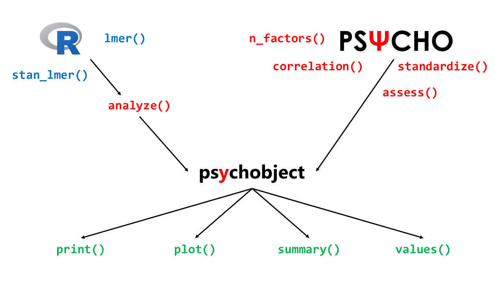

------


# Overview

```{r, echo=F, message=FALSE, warning=FALSE}
library(knitr)
library(tidyverse)
library(broom)
library(rstanarm)
```


## Installation


### Install R and R Studio


- Go here: [https://cloud.r-project.org/](https://cloud.r-project.org/)
- Download the last version for your OS
- Install it
- Go here: [https://www.rstudio.com/products/rstudio/download/#download](https://www.rstudio.com/products/rstudio/download/#download)
- Download the right version for your OS
- Install it
- Start R studio

### Install the psycho package

If you've never used `psycho`, enter this in the console and press enter:
```{r, eval = FALSE}
install.packages("psycho")

# Or this for the dev version:
install.packages("devtools")
library(devtools)
devtools::install_github("https://github.com/neuropsychology/psycho.R")
```

Else, just put this at the beginning of every script:
```{r}
library(psycho)
```


## General Workflow


The package mainly revolves around the `psychobject`. Main functions from the package return this type, and the `analyze()` function transforms other R objects into psychobjects. Then, 4 functions can be applied on a psychobject: `summary()`, `print()`, `plot()` and `values()`.

```{r, out.width=700, echo = FALSE, eval = TRUE, fig.align='center'}

```

<!--  -->

------

# Examples 

## Correlation Table and Plot

It is possible to quickly run a correlation analysis on a dataframe with the flexible and powerful `correlation()` function.

### Basic Correlations
```{r, fig.width=8, eval = TRUE, fig.align='center', results='hide'}
library(psycho)

df <- iris

cor <- psycho::correlation(df, 
                           type = "full",
                           method = "pearson",
                           adjust = "none")

summary(cor)
```

```{r echo=FALSE, message=FALSE, warning=FALSE}
kable(summary(cor))
```


You can save this correlation matrix using `write.csv(print(cor), "correlation_table.csv")`. That is very useful to *copy/paste* it from excel to a paper or a report :) 

You can also draw a quick visualization:
```{r, fig.width=8, eval = TRUE, fig.align='center'}
plot(cor)
```
 


### Partial, Corrected, Correlations

`correlation()` offers the possibility to run partial or semi-partial 
correleations, as well as printing them pairwise.

```{r, fig.width=8, eval = TRUE, fig.align='center', results='markup', comment=NA}
library(psycho)

df <- iris

pcor <- psycho::correlation(df, 
                           type = "partial",
                           method = "pearson",
                           adjust = "bonferroni")

summary(pcor)
```

You can also have access to the individual correlations as follows:

```{r, results='markup', comment=NA}
print(pcor)
```

------

## Standardize / Normalize / Z-score / Scale

The `standardize()` function allows you to easily scale and center all numeric variables of a dataframe. It is similar to the base function `scale()`, but presents some advantages: it is tidyverse-friendly, data-type friendly (*i.e.*, does not transform it into a matrix) and can handle dataframes with categorical data.

```{r, out.width=8, eval = TRUE, fig.align='center', results='markup', comment=NA}
library(psycho)
library(tidyverse)

iris %>% 
  select(Species, Sepal.Length, Petal.Length) %>% 
  psycho::standardize() %>% 
  summary()
```


------

## Signal Detection Theory Indices (dprime, beta...)

Signal detection theory (SDT) is used when psychologists want to measure the way we make decisions under conditions of uncertainty. SDT assumes that the decision maker is not a passive receiver of information, but an active decision-maker who makes difficult perceptual judgments under conditions of uncertainty. To apply signal detection theory to a data set where stimuli were either present or absent, and the observer categorized each trial as having the stimulus present or absent, the trials are sorted into one of four categories: **Hit**, **Miss**, **Correct Rejection** and **False Alarm**.


Based on the proportions of these types of trials, we can compute indices of sensitivity and response bias:

- **d'** (*d prime*): The sensitivity. Reflects the distance between the two distributions: signal, and signal+noise and corresponds to the Z value of the hit-rate minus that of the false-alarm rate.
- **beta**: The bias (criterion). The value for beta is the ratio of the normal density functions at the criterion of the Z values used in the computation of d'. This reflects an observer's bias to say 'yes' or 'no' with the unbiased observer having a value around 1.0. As the bias to say 'yes' increases (liberal), resulting in a higher hit-rate and false-alarm-rate, beta approaches 0.0. As the bias to say 'no' increases (conservative), resulting in a lower hit-rate and false-alarm rate, beta increases over 1.0 on an open-ended scale.
- **A'** (*aprime*): Non-parametric estimate of discriminability. An A' near 1.0 indicates good discriminability, while a value near 0.5 means chance performance.
- **B'\'D** (*b prime prime d*): Non-parametric estimate of bias. A B''D equal to 0.0 indicates no bias, positive numbers represent conservative bias (*i.e.*, a tendency to answer 'no'), negative numbers represent liberal bias (i.e. a tendency to answer 'yes'). The maximum absolute value is 1.0.
- **c**: Another index of bias. the number of standard deviations from the midpoint between these two distributions, *i.e.*, a measure on a continuum from "conservative" to "liberal".

To compute them with `psycho`, simply run the following:

```{r, out.width=8, eval = TRUE, fig.align='center', results='hide', comment=NA}
library(psycho)

# Let's simulate three participants with different results at a perceptual detection task
df <- data.frame(Participant = c("A", "B", "C"),
                 n_hit = c(1, 2, 5),
                 n_miss = c(6, 8, 1),
                 n_fa = c(1, 3, 5), 
                 n_cr = c(4, 8, 9))

indices <- psycho::dprime(df$n_hit, df$n_miss, df$n_fa, df$n_cr)
df <- cbind(df, indices)
```
```{r echo=FALSE, message=FALSE, warning=FALSE}
kable(df)
```


------

## Assess

This function is useful in clinical activity. It is sometimes necessary to show to the patient, his family or other members of staff, a visual representation of his score. The `assess()` function also computes the percentile and the Z-score, often needed for neuropsychological reports.


```{r, fig.width=7, fig.height=4.5, eval = TRUE, results='markup', fig.align='center', comment=NA}
library(psycho)

results <- psycho::assess(124, mean=100, sd=15)

# Print it
print(results)

# Plot it
plot(results)
```

It is also possible to custom the plot a bit (see the [documentation](https://www.rdocumentation.org/packages/psycho/versions/0.0.8/topics/assess) for available parameters).

```{r, fig.width=7, fig.height=4.5, eval = TRUE, results='markup', fig.align='center'}
library(psycho)

results <- psycho::assess(85, mean=100, sd=15, linecolor = "orange", fillcolor = "#4CAF50")

# Plot it
plot(results)
```


------

## Custom Plots

In general, the `plot()` function returns, most of the times, a ggplot object. That means it remains quite flexible. Here's an example.


```{r eval=TRUE, fig.align='center', fig.height=4.5, fig.width=9, message=FALSE, warning=FALSE, results='markup'}
library(psycho)

# Let's create a correlation plot
p <- plot(psycho::correlation(iris))

# Custom theme and colours
p <- p + 
  scale_fill_gradientn(colors = c("#4CAF50", "#FFEB3B", "#FF5722")) +
  ylab("Variables\n") +
  labs(fill = "r") +
  theme(plot.background = element_rect(fill = "#607D8B"),
        axis.title.y = element_text(size = 20, angle = 90, colour="white"),
        axis.text = element_text(size = 15, colour="white"),
        legend.title = element_text(size = 20, colour="white"),
        legend.text = element_text(size = 15, colour="white"),
        title = element_text(size = 16, colour="white"))
p

```


------

## Single-case methods

### Crawford-Howell (1998) t-test for single-case vs. control group

Neuropsychologists often need to compare a single case to a small control group. However, the standard two-sample t-test does not work because the case is only one observation. Crawford and Garthwaite (2012) demonstrate that the Crawford-Howell (1998) t-test is a better approach (in terms of controlling Type I error rate) than other commonly-used alternatives.


```{r echo=TRUE, message=FALSE, warning=FALSE, results='markup'}
library(psycho)

case1 <- 82 # The IQ of a patient
case2 <- 61 # The IQ of another patient
controls <- c(86, 100, 112, 95, 121, 102) # The IQs of a control group

rez <- crawford.test(case1, controls)
rez <- crawford.test(case2, controls)
```


### Mellenbergh & van den Brink (1998) test for pre-post comparison

Clinicians willing to check if their intervention had an effect on a single participant might want to use the Mellenbergh & van den Brink (1998) test, comparing the difference between baseline and post-test to the standart deviation of a control group.

```{r echo=TRUE, message=FALSE, warning=FALSE, results='markup'}
library(psycho)

t0 <- 82 # The IQ of a patient at baseline
t1 <- 105 # The IQ of a patient after the new therapy
controls <- c(94, 100, 108, 95, 102, 94) # The IQs of a control group

rez <- mellenbergh.test(t0, t1, controls = controls)

# if we do not have a control group, we can also directly enter the SD of the score.
# For IQ, the SD is of 15.
rez <- mellenbergh.test(t0, t1, controls = 15)
```


------

## How many factors/components to retain?

The `n_factors()` function is useful in before running principal component (PCA) or factor (FA) analysis. As many statistical methods exists to that purpose, this function gathers them together and gives an overview on the most frequent result. It also draw a nice plot with the eigenvalues and the proportion of explained  variance.


```{r echo=TRUE, message=FALSE, warning=FALSE, results='hide'}
results <- attitude %>%
  select_if(is.numeric) %>% 
  psycho::n_factors()

# Get a summary
summary(results)
```

```{r echo=FALSE, message=FALSE, warning=FALSE}
kable(summary(results))
```

We can also extract the final result (the optimal number of factors) for each method:

```{r echo=FALSE, message=FALSE, warning=FALSE, results='hide'}
psycho::values(results)$methods
```

```{r echo=FALSE, message=FALSE, warning=FALSE}
kable(psycho::values(results)$methods)
```

And, of course, plot it :)

```{r, fig.width=7, fig.height=4.5, eval = TRUE, results='markup', fig.align='center'}
plot(results)
```
     
     
------

## Analyze the Mixed-Modelling Framework

This is possibly the most important function of the `psycho` package. Its goal is to transform complex outputs of complex statistical routines into something readable, interpretable, and formatted. It is designed to work with frequentist and Bayesian mixed models, which is the central statistical method for psychological science.

### Data Creation

Let's start by creating a dataframe similar to those found in psychological science.

```{r, results='hide'}
set.seed(666)
df <- data.frame(Participant = as.factor(rep(1:25, each = 4)), 
                 Item = rep_len(c("i1", "i2", "i3", "i4"), 100), 
                 Condition = rep_len(c("A", "B", "A", "B", "B"), 20), 
                 Error = as.factor(sample(c(0, 1), 100, replace = T)),
                 RT = rnorm(100, 30, .2), 
                 Stress = runif(100, 3, 5))

# Standardize the numeric variables.
df <- psycho::standardize(df)

# Take a look  at the first 10 rows
head(df)
```

```{r echo=FALSE, message=FALSE, warning=FALSE}
kable(head(df))
```

This dataframe contains the data of 25 participants (labelled from 1 to 25). Each saw 4 different items (i1-i4) in two conditions (A and B). We measured, for each item, if the response was correct or not (Error), its reaction time (RT) and the stress associated with the trial.

### Ancient Approach

In order to investigate the effect of the condition on the reaction time RT, the traditional, ancient and obsolete routine is 1) to compute the mean for each participant, and 2) run an ANOVA.

```{r message=FALSE, warning=FALSE, results='markup', comment=NA}
# Format data
df_for_anova <- df %>% 
  dplyr::group_by(Participant, Condition) %>% 
  dplyr::summarise(RT = mean(RT))

# Run the anova
anova <- aov(RT ~ Condition + Error(Participant), df_for_anova)
summary(anova)
```

As we can see, the effect of the condition is not significant (unsuprisingly, as data was generated randomly). One of the many flaws of this approach is that we lose information about intra-individual and item-related variability.


### Mixed Linear Regressions (lme4, lmerTest)

The use of the mixed-modelling framework allows us to add the items as random factors.

```{r fig.align='center', message=FALSE, warning=FALSE, val=TRUE, results='markup', comment=NA}
library(lme4)

fit <- lme4::lmer(RT ~ Condition + (1|Participant) + (1|Item), data=df)

# Traditional output
summary(fit)
```

As the output is a bit messy, the `analyze()` function will munge this into something nicely formatted.

```{r, message=FALSE, results="hide"}
results <- psycho::analyze(fit)

# We can extract a formatted summary table
summary(results, round = 2)
```
```{r echo=FALSE, message=FALSE, warning=FALSE}
kable(summary(results, round = 2))
```


We can also print it in a text format!

```{r, results='markup', comment=NA}
print(results)
```


### Bayesian Mixed Linear Regressions (rstanarm)

However, as the frequentist framework is criticized, it is advised to switch to the Bayesian framework. Unfortunately, interpretation of these models remain unfamiliar to regular psychologists. But stay calm, because `analyze()` handles this for you. 

```{r fig.align='center', message=FALSE, warning=FALSE, val=TRUE, results='hide'}
library(rstanarm)

fit <- rstanarm::stan_lmer(RT ~ Condition + (1|Participant) + (1|Item), data=df)

# Traditional output
results <- psycho::analyze(fit, effsize=T)
summary(results, round=2)
```

```{r echo=FALSE, message=FALSE, warning=FALSE}
kable(summary(results, round = 2))
```

```{r, results='markup', comment=NA}
print(results)
```

We can also plot the effects:
```{r, fig.width=7, fig.height=4.5, eval = TRUE, results='markup', fig.align='center'}
plot(results)
```

Obviously, you need to learn more about Bayesian analyses before running them. You can find more information in the rstanarm's [vignettes](https://CRAN.R-project.org/package=rstanarm/vignettes/rstanarm.html).


------

## Visualize a Bayesian Model


We often want to visualize our models. While it is relatively easy for simple models such as non-mixed and non-multiple regressions, the addition of predictors and random effects tend to decouple their results from our actual data.

One thing we can do is to plot the predicted values. Let's start with simple models (based on the iris dataset).

```{r, results='hide'}
library(psycho)

set.seed(666)
fit <- rstanarm::stan_glm(Sepal.Width ~ Sepal.Length + Petal.Width, data=iris)
predicted_data <- psycho::get_predicted(fit)
```

```{r, results='markup', comment=NA}
names(predicted_data)
```

As we can see, the `get_predicted` function added three variables, corresponding to the median and 90% credible interval of the predicted posterior distribution. Let's plot, first, the predicted values against the true values.

```{r, fig.width=7, fig.height=4.5, eval = TRUE, results='markup', fig.align='center'}
ggplot(predicted_data, aes(x=Sepal.Width, y=pred_Sepal.Width_median)) +
  geom_point() +
  geom_smooth(method="lm")
```
We can also extract a new dataframe based on all combinations of values and plot them to better illustrate our model.

```{r, fig.width=7, fig.height=4.5, eval = TRUE, results='markup', fig.align='center'}
new_data <- psycho::get_predicted(fit, newdf=T) %>% 
  group_by(Sepal.Length, Petal.Width) %>% 
  summarise_all(mean)

ggplot(new_data, aes(x=Sepal.Length, y=pred_Sepal.Width_median, alpha=Petal.Width, group=Petal.Width)) +
  geom_point() +
  geom_line()
```

```{r echo=FALSE, message=FALSE, warning=FALSE, results='hide'}
summary(analyze(fit), 2)
```
```{r echo=FALSE, message=FALSE, warning=FALSE}
kable(summary(analyze(fit), 2))
```


As you can see, the representation of the model is rather coherent with its paremeters. What now if we specify an interaction in the model?

```{r, results='hide'}
set.seed(666)
names(iris)
fit <- rstanarm::stan_glm(Sepal.Width ~ Sepal.Length * Petal.Width, data=iris)

new_data <- psycho::get_predicted(fit, newdf=T) %>% 
  group_by(Sepal.Length, Petal.Width) %>% 
  summarise_all(mean)
```

```{r, fig.width=7, fig.height=4.5, eval = TRUE, results='markup', fig.align='center'}
ggplot(new_data, aes(x=Sepal.Length, y=pred_Sepal.Width_median, alpha=Petal.Width, group=Petal.Width)) +
  geom_point() +
  geom_line()
```

