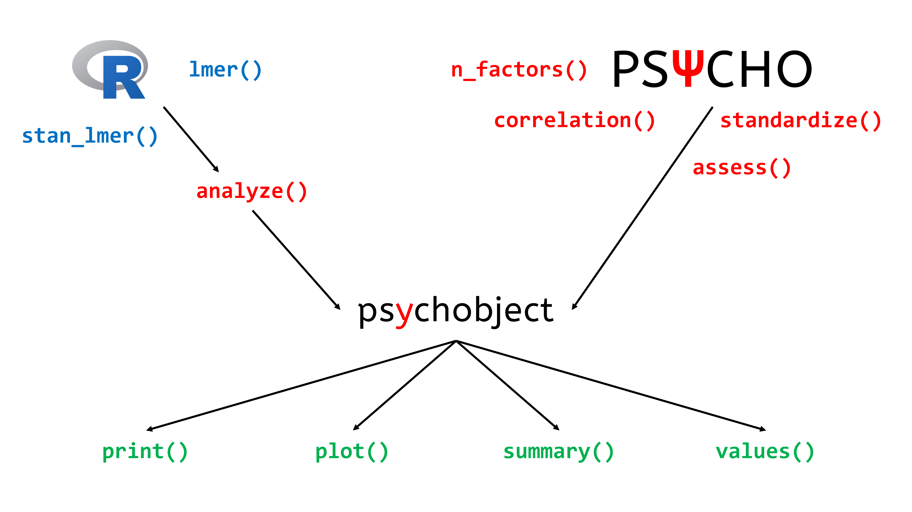

------


# Overview

```{r, echo=F, message=FALSE, warning=FALSE}
library(knitr)
library(dplyr)
library(ggplot2)
library(rstanarm)
```


The package mainly revolves around the `psychobject`. Main functions from the package return this type, and the `analyze()` function transforms other R objects into psychobjects. 4 functions can be then applied on a psychobject: `summary()`, `print()`, `plot()` and `values()`.

```{r, out.width=700, echo = FALSE, eval = TRUE, fig.align='center'}

```

# Installation


### Install R and R Studio


- Go here: [https://cran.r-project.org/](https://cran.r-project.org/)
- Download the last version for your OS
- Install it
- Go here: [https://www.rstudio.com/products/rstudio/download/#download](https://www.rstudio.com/products/rstudio/download/#download)
- Download the right version for your OS
- Install it
- Start R studio

### Install the psycho package

If you've never used `psycho`, enter one of the following in the console and press enter:
```{r, eval = FALSE}
# This for the stable version:
install.packages("psycho")

# Or this for the dev version:
install.packages("devtools")
library(devtools)
devtools::install_github("neuropsychology/psycho.R")
```

**In case of error**: Sometimes the installation fails, and you might find in the red output the following lines:
```r
there is no package called ‘**thenameofapackage**’
ERROR: lazy loading failed for package ‘psycho’
```
Try installing the missing packages (`install.packages("thenameofapackage")`) and then, install psycho again (sometimes this can be done several times).

Anyway, once you have `psycho`, just put this at the beginning of every script:
```{r}
library(psycho)
```


<!--  -->

------

# Guides

- [Bayesian Analysis in Psychology](https://CRAN.R-project.org/package=psycho/vignettes/bayesian.html)


# Examples

- [Formatted Correlation with Effect Size](https://neuropsychology.github.io/psycho.R/2018/06/28/analyze_correlation.html)
- [Extracting a Reference Grid of your Data for Machine Learning Models Visualization](https://neuropsychology.github.io/psycho.R/2018/06/25/refdata.html)
- [Copy/paste t-tests Directly to Manuscripts](https://neuropsychology.github.io/psycho.R/2018/06/19/analyze_ttest.html)
- [Easy APA Formatted Bayesian Correlation](https://neuropsychology.github.io/psycho.R/2018/06/11/bayesian_correlation.html)
- [Fancy Plot (with Posterior Samples) for Bayesian Regressions](https://neuropsychology.github.io/psycho.R/2018/06/03/plot_bayesian_model.html)
- [How Many Factors to Retain in Factor Analysis](https://neuropsychology.github.io/psycho.R/2018/05/24/n_factors.html)
- [Beautiful and Powerful Correlation Tables](https://neuropsychology.github.io/psycho.R/2018/05/20/correlation.html)
- [Format and Interpret Linear Mixed Models](https://neuropsychology.github.io/psycho.R/2018/05/10/interpret_mixed_models.html)
- [How to do Repeated Measures ANOVAs](https://neuropsychology.github.io/psycho.R/2018/05/01/repeated_measure_anovas.html)
- [Standardize (Z-score) a dataframe](https://neuropsychology.github.io/psycho.R/2018/03/29/standardize.html)
- [Compute Signal Detection Theory Indices](https://neuropsychology.github.io/psycho.R/2018/03/29/SDT.html)
- [Installing R, R Studio and psycho](https://neuropsychology.github.io/psycho.R/2018/03/21/installingR.html)


<!-- # Other  -->


<!-- ## Custom Plots -->

<!-- In general, the `plot()` function returns, most of the times, a ggplot object. That means it remains quite flexible. Here's an example. -->


<!-- ```{r eval=TRUE, fig.align='center', fig.height=4.5, fig.width=9, message=FALSE, warning=FALSE, results='markup'} -->
<!-- library(psycho) -->

<!-- # Let's create a correlation plot -->
<!-- p <- plot(psycho::correlation(iris)) -->

<!-- # Custom theme and colours -->
<!-- p <- p + -->
<!--   scale_fill_gradientn(colors = c("#4CAF50", "#FFEB3B", "#FF5722")) + -->
<!--   ylab("Variables\n") + -->
<!--   labs(fill = "r") + -->
<!--   theme( -->
<!--     plot.background = element_rect(fill = "#607D8B"), -->
<!--     axis.title.y = element_text(size = 20, angle = 90, colour = "white"), -->
<!--     axis.text = element_text(size = 15, colour = "white"), -->
<!--     legend.title = element_text(size = 20, colour = "white"), -->
<!--     legend.text = element_text(size = 15, colour = "white"), -->
<!--     title = element_text(size = 16, colour = "white") -->
<!--   ) -->
<!-- p -->
<!-- ``` -->


<!-- ------ -->

<!-- ## Single-case methods -->

<!-- ### Crawford-Garthwaite (2007) Bayesian test for single-case vs. control group -->

<!-- Neuropsychologists often need to compare a single case to a small control group. However, the standard two-sample t-test does not work because the case is only one observation. Crawford and Garthwaite (2012) demonstrate that the Crawford-Garthwaite (2007) t-test is a better approach (in terms of controlling Type I error rate) than other commonly-used alternatives. -->


<!-- ```{r echo=TRUE, message=FALSE, warning=FALSE, results='markup'} -->
<!-- library(psycho) -->

<!-- patient <- 61 # The IQ of a patient -->
<!-- controls <- c(86, 100, 112, 95, 121, 102) # The IQs of a control group -->

<!-- result <- crawford.test(patient, controls) -->
<!-- print(result) -->
<!-- plot(result) -->
<!-- ``` -->

<!-- ### Crawford-Howell (1998) t-test for dissociation -->

<!-- Assessing dissociation between processes is a fundamental part of clinical neuropsychology. However, while the detection of suspected impairments is a fundamental feature of single-case studies, evidence of an impairment on a given task usually becomes of theoretical interest only if it is observed in the context of less impaired or normal performance on other tasks. Crawford and Garthwaite (2012) demonstrate that the Crawford-Howell (1998) t-test for dissociation is a better approach (in terms of controlling Type I error rate) than other commonly-used alternatives. -->


<!-- ```{r echo=TRUE, message=FALSE, warning=FALSE, results='markup'} -->
<!-- library(psycho) -->

<!-- case_X <- 132 -->
<!-- case_Y <- 7 -->
<!-- controls_X <- c(100, 125, 89, 105, 109, 99) -->
<!-- controls_Y <- c(7, 8, 9, 6, 7, 10) -->

<!-- result <- crawford_dissociation.test(case_X, case_Y, controls_X, controls_Y) -->
<!-- ``` -->


<!-- ### Mellenbergh & van den Brink (1998) test for pre-post comparison -->

<!-- Clinicians willing to check if their intervention had an effect on a single participant might want to use the Mellenbergh & van den Brink (1998) test, comparing the difference between baseline and post-test to the standart deviation of a control group. -->

<!-- ```{r echo=TRUE, message=FALSE, warning=FALSE, results='markup'} -->
<!-- library(psycho) -->

<!-- t0 <- 82 # The IQ of a patient at baseline -->
<!-- t1 <- 105 # The IQ of a patient after the new therapy -->
<!-- controls <- c(94, 100, 108, 95, 102, 94) # The IQs of a control group -->

<!-- rez <- mellenbergh.test(t0, t1, controls = controls) -->

<!-- # if we do not have a control group, we can also directly enter the SD of the score. -->
<!-- # For IQ, the SD is of 15. -->
<!-- rez <- mellenbergh.test(t0, t1, controls = 15) -->
<!-- ``` -->


# Credits

This package helped you? Don't forget to cite the various packages you used :)

You can cite `psycho` as follows:

- Makowski, (2018). *The psycho Package: An Efficient and Publishing-Oriented Workflow for Psychological Science*. Journal of Open Source Software, 3(22), 470. https://doi.org/10.21105/joss.00470


# Contribution

Improve this vignette by modifying [this](https://github.com/neuropsychology/psycho.R/blob/master/vignettes/overview.Rmd) file!
