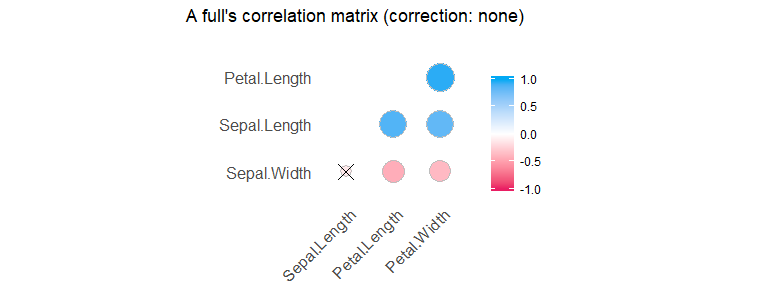
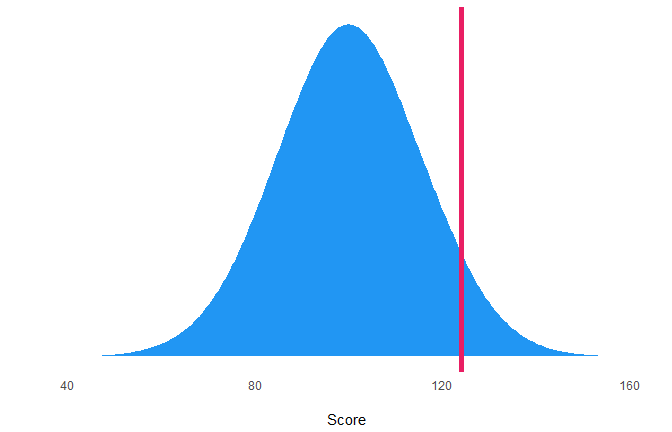
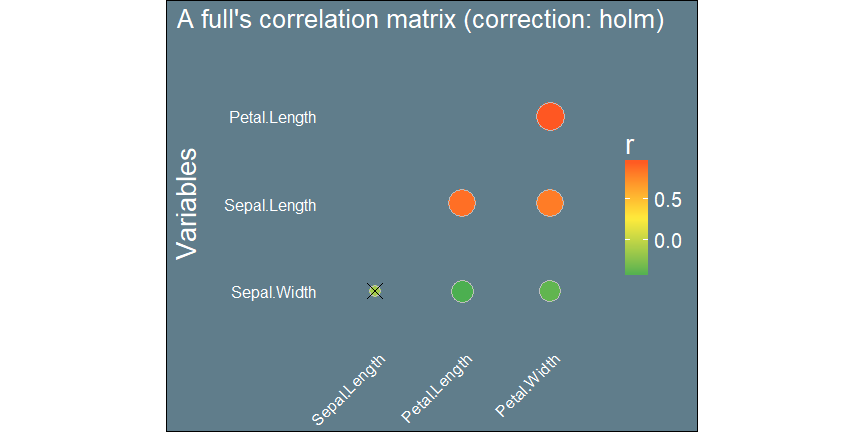

------

# Index

- [Overview](https://CRAN.R-project.org/package=psycho/vignettes/overview.html)
- Bayesian Analyses in Psychology

# Overview


## Installation


### Install R and R Studio


- Go here: [https://cran.r-project.org/](https://cran.r-project.org/)
- Download the last version for your OS
- Install it
- Go here: [https://www.rstudio.com/products/rstudio/download/#download](https://www.rstudio.com/products/rstudio/download/#download)
- Download the right version for your OS
- Install it
- Start R studio

### Install the psycho package

If you've never used `psycho`, enter one of the following in the console and press enter:

```r
# This for the stable version:
install.packages("psycho")

# Or this for the dev version:
install.packages("devtools")
library(devtools)
devtools::install_github("neuropsychology/psycho.R")
```

**In case of error**: Sometimes the installation fails, and you might find in the redish output the following lines:
```r
there is no package called ‘**thenameofapackage**’
ERROR: lazy loading failed for package ‘psycho’
```
Try installing the missing packages (`install.packages("thenameofapackage")`) and try the installation of psycho again.

Anyway, once you have `psycho`, just put this at the beginning of every script:

```r
library(psycho)
```


## General Workflow


The package mainly revolves around the `psychobject`. Main functions from the package return this type, and the `analyze()` function transforms other R objects into psychobjects. Then, 4 functions can be applied on a psychobject: `summary()`, `print()`, `plot()` and `values()`.


<!--  -->

------

# Examples 

## Correlation Table and Plot

It is possible to quickly run a correlation analysis on a dataframe with the flexible and powerful `correlation()` function.

### Basic Correlations

```r
library(psycho)

df <- iris

cor <- psycho::correlation(df,
  type = "full",
  method = "pearson",
  adjust = "none"
)

summary(cor)
```


               Sepal.Length   Sepal.Width   Petal.Length 
-------------  -------------  ------------  -------------
Sepal.Length                                             
Sepal.Width    -0.12                                     
Petal.Length   0.87***        -0.43***                   
Petal.Width    0.82***        -0.37***      0.96***      


You can save this correlation matrix using `write.csv(print(cor), "correlation_table.csv")`. That is very useful to *copy/paste* it from excel to a paper or a report :) 

You can also draw a quick visualization:

```r
plot(cor)
```


 


### Partial, Corrected, Correlations

`correlation()` offers the possibility to run partial or semi-partial 
correleations, as well as printing them pairwise.


```r
library(psycho)

df <- iris

pcor <- psycho::correlation(df,
  type = "partial",
  method = "pearson",
  adjust = "bonferroni"
)

summary(pcor)
```

```
             Sepal.Length Sepal.Width Petal.Length
Sepal.Length                                      
Sepal.Width       0.63***                         
Petal.Length      0.72***    -0.62***             
Petal.Width      -0.34***     0.35***      0.87***
```

You can also have access to the individual correlations as follows:


```r
print(pcor)
```

```
Pearson Partial Correlation (p value correction: bonferroni):
   - Sepal.Length - Sepal.Width:   Results of the Pearson correlation showed a significant and strong negative association between Sepal.Length and Sepal.Width (r(148) = 0.63, p < .001***).
   - Sepal.Length - Petal.Length:   Results of the Pearson correlation showed a significant and strong negative association between Sepal.Length and Petal.Length (r(148) = 0.72, p < .001***).
   - Sepal.Width - Petal.Length:   Results of the Pearson correlation showed a significant and strong positive association between Sepal.Width and Petal.Length (r(148) = -0.62, p < .001***).
   - Sepal.Length - Petal.Width:   Results of the Pearson correlation showed a significant and moderate positive association between Sepal.Length and Petal.Width (r(148) = -0.34, p < .001***).
   - Sepal.Width - Petal.Width:   Results of the Pearson correlation showed a significant and moderate negative association between Sepal.Width and Petal.Width (r(148) = 0.35, p < .001***).
   - Petal.Length - Petal.Width:   Results of the Pearson correlation showed a significant and strong negative association between Petal.Length and Petal.Width (r(148) = 0.87, p < .001***).
```

------

## Standardize / Normalize / Z-score / Scale

The `standardize()` function allows you to easily scale and center all numeric variables of a dataframe. It is similar to the base function `scale()`, but presents some advantages: it is tidyverse-friendly, data-type friendly (*i.e.*, does not transform it into a matrix) and can handle dataframes with categorical data.


```r
library(psycho)
library(dplyr)

iris %>%
  dplyr::select(Species, Sepal.Length, Petal.Length) %>%
  psycho::standardize() %>%
  summary()
```

```
       Species    Sepal.Length       Petal.Length    
 setosa    :50   Min.   :-1.86378   Min.   :-1.5623  
 versicolor:50   1st Qu.:-0.89767   1st Qu.:-1.2225  
 virginica :50   Median :-0.05233   Median : 0.3354  
                 Mean   : 0.00000   Mean   : 0.0000  
                 3rd Qu.: 0.67225   3rd Qu.: 0.7602  
                 Max.   : 2.48370   Max.   : 1.7799  
```


------

## Signal Detection Theory Indices (dprime, beta...)

Signal detection theory (SDT) is used when psychologists want to measure the way we make decisions under conditions of uncertainty. SDT assumes that the decision maker is not a passive receiver of information, but an active decision-maker who makes difficult perceptual judgments under conditions of uncertainty. To apply signal detection theory to a data set where stimuli were either present or absent, and the observer categorized each trial as having the stimulus present or absent, the trials are sorted into one of four categories: **Hit**, **Miss**, **Correct Rejection** and **False Alarm**.


Based on the proportions of these types of trials, we can compute indices of sensitivity and response bias:

- **d'** (*d prime*): The sensitivity. Reflects the distance between the two distributions: signal, and signal+noise and corresponds to the Z value of the hit-rate minus that of the false-alarm rate.
- **beta**: The bias (criterion). The value for beta is the ratio of the normal density functions at the criterion of the Z values used in the computation of d'. This reflects an observer's bias to say 'yes' or 'no' with the unbiased observer having a value around 1.0. As the bias to say 'yes' increases (liberal), resulting in a higher hit-rate and false-alarm-rate, beta approaches 0.0. As the bias to say 'no' increases (conservative), resulting in a lower hit-rate and false-alarm rate, beta increases over 1.0 on an open-ended scale.
- **A'** (*aprime*): Non-parametric estimate of discriminability. An A' near 1.0 indicates good discriminability, while a value near 0.5 means chance performance.
- **B'\'D** (*b prime prime d*): Non-parametric estimate of bias. A B''D equal to 0.0 indicates no bias, positive numbers represent conservative bias (*i.e.*, a tendency to answer 'no'), negative numbers represent liberal bias (i.e. a tendency to answer 'yes'). The maximum absolute value is 1.0.
- **c**: Another index of bias. the number of standard deviations from the midpoint between these two distributions, *i.e.*, a measure on a continuum from "conservative" to "liberal".

To compute them with `psycho`, simply run the following:


```r
library(psycho)

# Let's simulate three participants with different results at a perceptual detection task
df <- data.frame(
  Participant = c("A", "B", "C"),
  n_hit = c(1, 2, 5),
  n_fa = c(1, 3, 5),
  n_miss = c(6, 8, 1),
  n_cr = c(4, 8, 9)
)

indices <- psycho::dprime(df$n_hit, df$n_fa, df$n_miss, df$n_cr)
df <- cbind(df, indices)
```

Participant    n_hit   n_fa   n_miss   n_cr       dprime        beta      aprime         bppd            c
------------  ------  -----  -------  -----  -----------  ----------  ----------  -----------  -----------
A                  1      1        6      4   -0.1925836   0.8518485   0.5000000    0.9459459    0.8326077
B                  2      3        8      8   -0.1981923   0.8735807   0.4106061    0.8285714    0.6819377
C                  5      5        1      9    0.9952151   0.8827453   0.5000000   -0.9230769   -0.1253182


------

## Assess

This function is useful in clinical activity. It is sometimes necessary to show to the patient, his family or other members of staff, a visual representation of his score. The `assess()` function also computes the percentile and the Z-score, often needed for neuropsychological reports.


```r
library(psycho)

results <- psycho::assess(124, mean = 100, sd = 15)

# Print it
print(results)
```

```
The participant (score = 124) is positioned at 1.6 standard deviations from the mean (M = 100, SD = 15). The participant's score is greater than 94.51 % of the general population.
```

```r
# Plot it
plot(results)
```



It is also possible to custom the plot a bit (see the [documentation](https://www.rdocumentation.org/packages/psycho/versions/0.0.8/topics/assess) for available parameters).


```r
library(psycho)

results <- psycho::assess(85, mean = 100, sd = 15, linecolor = "orange", fillcolor = "#4CAF50")

# Plot it
plot(results)
```


------

## Custom Plots

In general, the `plot()` function returns, most of the times, a ggplot object. That means it remains quite flexible. Here's an example.


```r
library(psycho)

# Let's create a correlation plot
p <- plot(psycho::correlation(iris))

# Custom theme and colours
p <- p +
  scale_fill_gradientn(colors = c("#4CAF50", "#FFEB3B", "#FF5722")) +
  ylab("Variables\n") +
  labs(fill = "r") +
  theme(
    plot.background = element_rect(fill = "#607D8B"),
    axis.title.y = element_text(size = 20, angle = 90, colour = "white"),
    axis.text = element_text(size = 15, colour = "white"),
    legend.title = element_text(size = 20, colour = "white"),
    legend.text = element_text(size = 15, colour = "white"),
    title = element_text(size = 16, colour = "white")
  )
p
```




------

## Single-case methods

### Crawford-Howell (1998) t-test for single-case vs. control group

Neuropsychologists often need to compare a single case to a small control group. However, the standard two-sample t-test does not work because the case is only one observation. Crawford and Garthwaite (2012) demonstrate that the Crawford-Howell (1998) t-test is a better approach (in terms of controlling Type I error rate) than other commonly-used alternatives.


```r
library(psycho)

case <- 61 # The IQ of a patient
controls <- c(86, 100, 112, 95, 121, 102) # The IQs of a control group

rez <- crawford.test(case, controls)
```

```
## The Crawford-Howell (1998) t-test suggests that the patient's score (61) is significantly different from the controls (M = 102.67, SD = 12.39, t(5) = -3.11, p < .05*). The patient's score is lower than 97.36% of the control population.
```

### Crawford-Howell (1998) t-test for dissociation

Assessing dissociation between processes is a fundamental part of clinical neuropsychology. However, while the detection of suspected impairments is a fundamental feature of single-case studies, evidence of an impairment on a given task usually becomes of theoretical interest only if it is observed in the context of less impaired or normal performance on other tasks. Crawford and Garthwaite (2012) demonstrate that the Crawford-Howell (1998) t-test for dissociation is a better approach (in terms of controlling Type I error rate) than other commonly-used alternatives.


```r
library(psycho)

case_X <- 132
case_Y <- 7
controls_X <- c(100, 125, 89, 105, 109, 99)
controls_Y <- c(7, 8, 9, 6, 7, 10)

rez <- crawford_dissociation.test(case_X, case_Y, controls_X, controls_Y)
```

```
## The Crawford-Howell (1998) t-test suggests no dissociation between test X and test Y (t(5) = 1.62, p > .1). The patient's score on test X is not significantly altered compared to its score on test Y.
```


### Mellenbergh & van den Brink (1998) test for pre-post comparison

Clinicians willing to check if their intervention had an effect on a single participant might want to use the Mellenbergh & van den Brink (1998) test, comparing the difference between baseline and post-test to the standart deviation of a control group.


```r
library(psycho)

t0 <- 82 # The IQ of a patient at baseline
t1 <- 105 # The IQ of a patient after the new therapy
controls <- c(94, 100, 108, 95, 102, 94) # The IQs of a control group

rez <- mellenbergh.test(t0, t1, controls = controls)
```

```
## The Mellenbergh & van den Brink (1998) test suggests that the change is significant (d = 23, 90% CI [9.93, 36.07], z = 2.90, p < .01**).
```

```r
# if we do not have a control group, we can also directly enter the SD of the score.
# For IQ, the SD is of 15.
rez <- mellenbergh.test(t0, t1, controls = 15)
```

```
## The Mellenbergh & van den Brink (1998) test suggests that the change is not significant (d = 23, 90% CI [-12.00, 58.00], z = 1.08, p > .1).
```


------

## How many factors/components to retain?

The `n_factors()` function is useful in before running principal component (PCA) or factor (FA) analysis. As many statistical methods exists to that purpose, this function gathers them together and gives an overview on the most frequent result. It also draw a nice plot with the eigenvalues and the proportion of explained  variance.


```r
results <- attitude %>%
  dplyr::select_if(is.numeric) %>%
  psycho::n_factors()

# Get a summary
summary(results)
```


 n.Factors   n.Methods   Eigenvalues   Cum.Variance
----------  ----------  ------------  -------------
         1           5     3.7163758      0.5309108
         2           3     1.1409219      0.6938997
         3           1     0.8471915      0.8149270
         4           0     0.6128697      0.9024798
         5           0     0.3236728      0.9487188
         6           0     0.2185306      0.9799375
         7           0     0.1404378      1.0000000

We can also extract the final result (the optimal number of factors) for each method:


Method                            n_optimal
-------------------------------  ----------
Optimal Coordinates                       1
Acceleration Factor                       1
Parallel Analysis                         1
Eigenvalues (Kaiser Criterion)            2
Velicer MAP                               1
BIC                                       2
Sample Size Adjusted BIC                  3
VSS Complexity 1                          1
VSS Complexity 2                          2

And, of course, plot it :)


```r
plot(results)
```


     
     
------

## Analyze the Mixed-Modelling Framework

This is possibly the most important function of the `psycho` package. Its goal is to transform complex outputs of complex statistical routines into something readable, interpretable, and formatted. It is designed to work with frequentist and Bayesian mixed models, which is the central statistical method for psychological science.

### Data Creation

Let's start by selecting a dataframe similar to those found in psychological science, included in the `psycho` package.


```r
df <- psycho::emotion

# Stabdardize the outcome
df$Subjective_Arousal <- psycho::standardize(df$Subjective_Arousal)

# Take a look  at the first 10 rows
head(df)
```


Participant_ID    Participant_Age  Participant_Sex   Item_Category   Item_Name       Trial_Order  Emotion_Condition    Subjective_Arousal   Subjective_Valence   Autobiographical_Link  Recall 
---------------  ----------------  ----------------  --------------  -------------  ------------  ------------------  -------------------  -------------------  ----------------------  -------
1S                       18.38467  Female            People          People_158_h              1  Neutral                      -1.1181966            0.5208333               63.281250  TRUE   
1S                       18.38467  Female            Faces           Faces_045_h               2  Neutral                      -0.9799275            4.1666667               22.135417  FALSE  
1S                       18.38467  Female            People          People_138_h              3  Neutral                      -0.6774638           25.5208333               55.989583  TRUE   
1S                       18.38467  Female            People          People_148_h              4  Neutral                      -1.5243622            0.0000000               44.791667  FALSE  
1S                       18.38467  Female            Faces           Faces_315_h               5  Neutral                      -0.6688220           45.8333333               30.208333  FALSE  
1S                       18.38467  Female            Faces           Faces_224_h               6  Neutral                      -1.4379440            0.0000000                8.072917  FALSE  

This dataframe contains the data of 19 participants. Each participant underwent 48 trials (therefore, there are 48 lines per participant), consisting in viewing negative and neutral pictures. We measured, for each item, the emotional arousal felt by the participant.

### Ancient Approach

In order to investigate the effect of the emotional condition on the subjective arousal, the traditional, ancient and obsolete routine is 1) to compute the mean for each participant, and 2) run an ANOVA.


```r
# Format data
df_for_anova <- df %>%
  dplyr::group_by(Participant_ID, Emotion_Condition) %>%
  dplyr::summarise(Subjective_Arousal = mean(Subjective_Arousal))

# Run the anova
aov_results <- aov(Subjective_Arousal ~ Emotion_Condition + Error(Participant_ID), df_for_anova)
summary(aov_results)
```

```

Error: Participant_ID
          Df Sum Sq Mean Sq F value Pr(>F)
Residuals 18  6.901  0.3834               

Error: Within
                  Df Sum Sq Mean Sq F value   Pr(>F)    
Emotion_Condition  1 11.864  11.864   117.7 2.51e-09 ***
Residuals         18  1.814   0.101                     
---
Signif. codes:  0 '***' 0.001 '**' 0.01 '*' 0.05 '.' 0.1 ' ' 1
```

As we can see, the effect of the condition is significant. One of the many flaws of this approach is that we lose information about intra-individual and item-related variability.


### Mixed Linear Regressions (lme4, lmerTest)

The use of the mixed-modelling framework allows us to add the items as random factors to account for the variance they induce.


```r
library(lmerTest)

fit <- lmerTest::lmer(Subjective_Arousal ~ Emotion_Condition + (1|Participant_ID) + (1|Item_Name), data = df)

# Traditional output
summary(fit)
```

```
Linear mixed model fit by REML. t-tests use Satterthwaite's method [
lmerModLmerTest]
Formula: Subjective_Arousal ~ Emotion_Condition + (1 | Participant_ID) +  
    (1 | Item_Name)
   Data: df

REML criterion at convergence: 1983.9

Scaled residuals: 
    Min      1Q  Median      3Q     Max 
-3.1474 -0.6965  0.0379  0.6502  3.4841 

Random effects:
 Groups         Name        Variance Std.Dev.
 Item_Name      (Intercept) 0.06825  0.2613  
 Participant_ID (Intercept) 0.18234  0.4270  
 Residual                   0.44952  0.6705  
Number of obs: 912, groups:  Item_Name, 48; Participant_ID, 19

Fixed effects:
                         Estimate Std. Error       df t value Pr(>|t|)    
(Intercept)               0.55877    0.11587 30.17223   4.822  3.8e-05 ***
Emotion_ConditionNeutral -1.11753    0.08752 46.00000 -12.769  < 2e-16 ***
---
Signif. codes:  0 '***' 0.001 '**' 0.01 '*' 0.05 '.' 0.1 ' ' 1

Correlation of Fixed Effects:
            (Intr)
Emtn_CndtnN -0.378
```

As the output is a bit messy, the `analyze()` function will munge this into something nicely formatted.


```r
results <- psycho::analyze(fit)

# We can extract a formatted summary table
summary(results, round = 2)
```

                           Variable                   Effect_Size     Coef     SE        t      df   Coef.std   SE.std    p   CI_lower   CI_higher
-------------------------  -------------------------  ------------  ------  -----  -------  ------  ---------  -------  ---  ---------  ----------
(Intercept)                (Intercept)                Very Small      0.56   0.12     4.82   30.17       0.00     0.00    0       0.33        0.79
Emotion_ConditionNeutral   Emotion_ConditionNeutral   Medium         -1.12   0.09   -12.77   46.00      -0.56     0.04    0      -1.29       -0.94


We can also print it in a text format!


```r
print(results)
```

```
The overall model predicting Subjective_Arousal (formula = Subjective_Arousal ~ Emotion_Condition + (1 | Participant_ID) +     (1 | Item_Name)) successfully converged and explained 55.61% of the variance of the endogen (the conditional R2). The variance explained by the fixed effects was of 30.87% (the marginal R2) and the one explained by the random effects of 24.75%. The model's intercept is at 0.56 (SE = 0.12, 95% CI [0.33, 0.79]). Within this model:
   - The effect of Emotion_ConditionNeutral is  significant (beta = -1.12, SE = 0.088, 95% CI [-1.29, -0.94], t(46.00) = -12.77, p < .001***) and can be considered as medium (std. beta = -0.56, std. SE = 0.044).
```


### Bayesian Mixed Linear Regressions (rstanarm)

However, as the frequentist framework is criticized, it is advised to switch to the Bayesian framework. Unfortunately, interpretation of these models remain unfamiliar to regular psychologists. But don't worry, because `analyze()` handles this for you. 


```r
library(rstanarm)

fit <- rstanarm::stan_lmer(Subjective_Arousal ~ Emotion_Condition + (1|Participant_ID) + (1|Item_Name), data = df)

# Traditional output
results <- psycho::analyze(fit, effsize = TRUE)
summary(results, round = 2)
```


Variable                    MPE   Median    MAD    Mean     SD   CI_lower   CI_higher   Very_Large   Large   Medium   Small   Very_Small   Opposite   Overlap
-------------------------  ----  -------  -----  ------  -----  ---------  ----------  -----------  ------  -------  ------  -----------  ---------  --------
(Intercept)                 100     0.56   0.12    0.56   0.12       0.35        0.74         0.00    0.03     0.66    0.31            0          0      2.46
Emotion_ConditionNeutral    100    -1.12   0.09   -1.12   0.09      -1.26       -0.96         0.02    0.97     0.00    0.00            0          0      0.00
R2                          100     0.55   0.02    0.55   0.02       0.53        0.58           NA      NA       NA      NA           NA         NA      0.00


```r
print(results)
```

```
We fitted a Markov Chain Monte Carlo gaussian (link = identity) model to predict Subjective_Arousal (formula = Subjective_Arousal ~ Emotion_Condition + (1 | Participant_ID) +     (1 | Item_Name)). Effect sizes are based on Cohen (1988) recommandations. The model's priors were set as follows: 

  ~ normal (location = (0), scale = (2.50))


The model explains between 48.49% and 60.11% of the outcome's variance (R2's median = 0.55, MAD = 0.016, 90% CI [0.53, 0.58]). The model's intercept is at 0.56 (MAD = 0.12, 90% CI [0.35, 0.74]). Within this model:

  - The effect of Emotion_ConditionNeutral has a probability of 100% that its coefficient is between -1.49 and -0.74 (Median = -1.12, MAD = 0.089, 90% CI [-1.26, -0.96], MPE = 100%).
    - There is a probability of 2.45% that this effect size is very large, 97.47% that this effect size is large, 0.075% that this effect size is medium, 0% that this effect size is small, 0% that this effect is very small and 0% that it has an opposite direction (between 0 and 0).
```

We can also plot the effects:

```r
plot(results)
```


Obviously, you need to learn more about Bayesian analyses before running them. You can find more information in the rstanarm's [vignettes](https://CRAN.R-project.org/package=rstanarm/vignettes/rstanarm.html).


Critically, see [**THIS**](https://CRAN.R-project.org/package=psycho/vignettes/bayesian.html) vignette for a guide to bayesian statistics for psychology.


## Credits

This package helped you? Don't forget to cite the various packages you used :)

You can cite `psycho` as follows:

- Makowski, (2018). *The psycho Package: an Efficient and Publishing-Oriented Workflow for Psychological Science*. Journal of Open Source Software, 3(22), 470. https://doi.org/10.21105/joss.00470


## Contribution

Improve this vignette by modifying [this](https://github.com/neuropsychology/psycho.R/blob/master/vignettes/overview.Rmd) file!
